

  

---

## About

Senior IAM Assistant Manager at **Deloitte** (Cyber & Strategic Risk), architecting enterprise **Saviynt IGA** governance, automated JML lifecycles, and large-scale identity data reconciliation across **300,000+ monthly identities**.

Bridging enterprise governance with software engineering — deploying Python automation pipelines, hardening hybrid directories (**Microsoft Entra ID / Active Directory**), and building autonomous developer systems.

---

## Tech Stack

  <a href="https://subhajitkar.com/?tab=iam">
    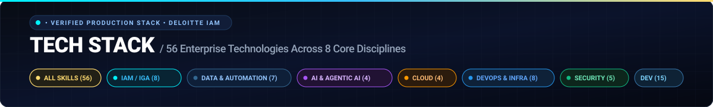
  </a>

 

### 🛡️ IAM / IGA (8) &middot; 8 Enterprise Technologies · Primary Specialization

<a href="https://subhajitkar.com/?tab=iam" title="Saviynt [Primary Expertise]">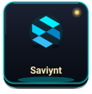</a>   <a href="https://subhajitkar.com/?tab=iam" title="SoD & RBAC [Primary Expertise]">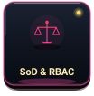</a> <a href="https://subhajitkar.com/?tab=iam" title="JML Lifecycle [Primary Expertise]">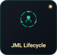</a>  <a href="https://subhajitkar.com/?tab=iam" title="OAuth & SAML [Primary Expertise]">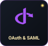</a> 

### ⚡ Data & Automation (7) &middot; 7 Enterprise Technologies · Core Identity Data Quality

<a href="https://subhajitkar.com/?tab=iam" title="Identity Recon [Primary Expertise]">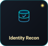</a>      

### 🤖 AI & Agentic AI (4) &middot; 4 Technologies · Multi-Agent & Protocol Systems

<a href="https://subhajitkar.com/?tab=iam" title="Agentic AI">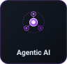</a> <a href="https://subhajitkar.com/?tab=iam" title="MCP">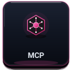</a> <a href="https://subhajitkar.com/?tab=iam" title="LLM Eng">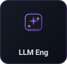</a> <a href="https://subhajitkar.com/?tab=iam" title="AI Workflows">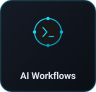</a>

### ☁️ Cloud Architecture (4) &middot; 4 Cloud Platforms & Enterprise Infrastructure

   

### 🛠️ DevOps & Infra (8) &middot; 8 Production CI/CD, Container & OS Tools

  <a href="https://subhajitkar.com/?tab=iam" title="Git">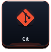</a>    <a href="https://subhajitkar.com/?tab=iam" title="Vite">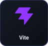</a> 

### 🔒 Cybersecurity & AppSec (5) &middot; 5 Enterprise Security & Protocol Verification Tools

 <a href="https://subhajitkar.com/?tab=iam" title="CyberArk">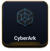</a> <a href="https://subhajitkar.com/?tab=iam" title="OWASP">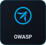</a>  

### 💻 Programming & Frameworks (15) &middot; 15 Languages, Runtimes & Frontend Systems

  <a href="https://subhajitkar.com/?tab=iam" title="TypeScript">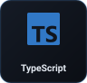</a> <a href="https://subhajitkar.com/?tab=iam" title="Node.js">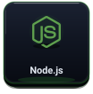</a>  <a href="https://subhajitkar.com/?tab=iam" title="Next.js">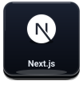</a> <a href="https://subhajitkar.com/?tab=iam" title="FastAPI">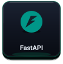</a> <a href="https://subhajitkar.com/?tab=iam" title="Flask">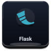</a> <a href="https://subhajitkar.com/?tab=iam" title="Postman">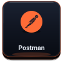</a> <a href="https://subhajitkar.com/?tab=iam" title="Three.js">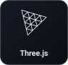</a>   <a href="https://subhajitkar.com/?tab=iam" title="HTML5">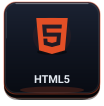</a> <a href="https://subhajitkar.com/?tab=iam" title="CSS3">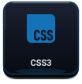</a> <a href="https://subhajitkar.com/?tab=iam" title="C++">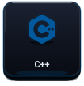</a>

### 🏢 Enterprise & Governance (5) &middot; 5 ITSM, HRMS, Audit & Prototyping Systems

    

  ★ Gold dot indicates verified <b>Primary Professional Expertise</b> directly central to Deloitte enterprise delivery.

---

## Enterprise Identity Governance &amp; Automation Pipeline

  <a href="https://subhajitkar.com/?tab=iam">
    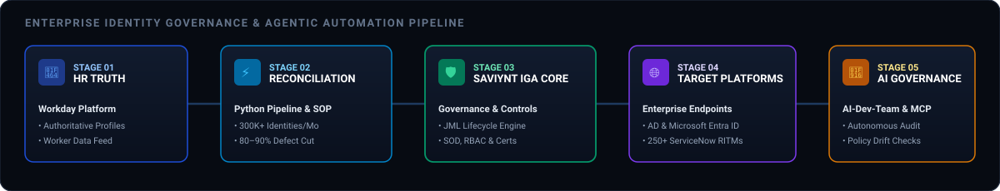
  </a>

  <code>Workday HRMS</code> &nbsp;&rarr;&nbsp;
  <code>Python ETL Engine (300K+/Mo)</code> &nbsp;&rarr;&nbsp;
  <code>Saviynt IGA Core (JML &amp; SoD)</code> &nbsp;&rarr;&nbsp;
  <code>AD &amp; Entra ID Endpoints</code> &nbsp;&rarr;&nbsp;
  <code>AI Dev Team Governance</code>

---

## Verified Enterprise Impact

  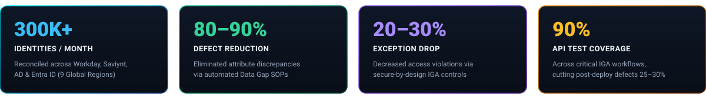

---

## Featured Engineering Projects

| 🤖 [AI-Dev-Team](https://github.com/ha4kerspidersks/AI-Dev-Team) | 🎯 [User-Role-Recommendations](https://github.com/ha4kerspidersks/User-Role-Recommendations) |
| :--- | :--- |
| Autonomous multi-agent AI engineering dev team coordinating 3,200+ specialized skills across Gemini, Claude, and Copilot backends.  **Tech:** `Python` &middot; `Node.js` &middot; `Model Context Protocol (MCP)` &middot; `Multi-Agent` &rarr; [**View Repository**](https://github.com/ha4kerspidersks/AI-Dev-Team) | Machine learning role mining & access anomaly detection system predicting least-privilege entitlement assignments.  **Tech:** `Python` &middot; `scikit-learn` &middot; `Pandas` &middot; `Role Mining` &middot; `RBAC` &rarr; [**View Repository**](https://github.com/ha4kerspidersks/User-Role-Recommendations) |
| 🔐 [React-Auth0-PermissionManager](https://github.com/ha4kerspidersks/React-Auth0-PermissionManager) | ⚡ [piescan](https://github.com/ha4kerspidersks/piescan) |
| Production RBAC permission management dashboard with OAuth 2.0 / OIDC tokens and fine-grained access control.  **Tech:** `React` &middot; `Auth0` &middot; `TypeScript` &middot; `Tailwind CSS` &rarr; [**View Repository**](https://github.com/ha4kerspidersks/React-Auth0-PermissionManager) | High-performance asynchronous network scanner and service fingerprinting engine for automated vulnerability auditing.  **Tech:** `Python` &middot; `Asyncio` &middot; `Raw Sockets` &middot; `Recon Engine` &rarr; [**View Repository**](https://github.com/ha4kerspidersks/piescan) |

---

## Experience

### **Assistant Manager &middot; Deloitte** *(Cyber &amp; Strategic Risk | May 2026 &ndash; Present)*
- Leading enterprise **Saviynt IGA** platform governance, continuous SoD compliance, and multi-tenant cloud directory federation.
- Architected automated Python reconciliation pipelines processing **300K+ monthly identities** across Workday, AD, and Microsoft Entra ID.

### **Consultant &middot; Deloitte** *(Cyber &amp; Strategic Risk | Jul 2023 &ndash; Apr 2026)*
- Reduced access exceptions by **20&ndash;30%** and post-deployment defects by **25&ndash;30%** across 9 global enterprise operational zones.
- Resolved **250+ ServiceNow RITMs**, automated 90% of critical API testing suites, and earned **13 Deloitte firm-wide awards**.

---

## Certifications &amp; Credentials

[-7E22CE?style=flat-square&logo=academia&logoColor=white)](https://subhajitkar.com)

---

  Designed with authentic vector assets &amp; data models from <a href="https://subhajitkar.com">subhajitkar.com</a> &middot; &copy; 2026 Subhajit Kar

