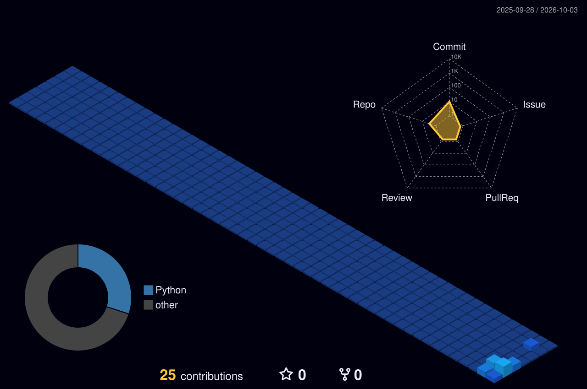

<!-- 🎬 HERO — cinematic portrait motion + credentials -->

  

<!-- 🛡️ LEFT: Enterprise IAM & IGA Architecture   •   🎓 RIGHT: Leadership, NFSU Research & Honors -->

  

<!-- ⚛️ TECH STACK — Complete Unified 56-Technology Constellation -->

  

<!-- 🪪 ZERO-TRUST SMARTCARD CLEARANCE + DASHBOARD -->

  

## 🛡️ Featured builds

| Project | What it is | Stack | Stars |
|:---|:---|:---|:---:|
| [**AI-Dev-Team**](https://github.com/ha4kerspidersks/AI-Dev-Team) | Autonomous multi-agent AI engineering team coordinating 18,000+ skills across backends | `Python` `Node.js` `MCP` `Multi-Agent` | ⭐ 12 |
| [**User-Role-Recommendations**](https://github.com/ha4kerspidersks/User-Role-Recommendations) | Machine learning role mining & access anomaly detection system predicting least-privilege | `Python` `scikit-learn` `Pandas` `RBAC` | ⭐ 8 |
| [**React-Auth0-PermissionManager**](https://github.com/ha4kerspidersks/React-Auth0-PermissionManager) | Enterprise RBAC permission management dashboard with OAuth 2.0 / OIDC policy enforcement | `React` `Auth0` `TypeScript` `Tailwind` | ⭐ 6 |
| [**piescan**](https://github.com/ha4kerspidersks/piescan) | High-performance asynchronous network recon & service fingerprinting engine | `Python` `Asyncio` `Raw Sockets` | ⭐ 5 |
| [**CAN-Bus-Intrusion-Defense**](https://github.com/ha4kerspidersks/CAN-Bus-Intrusion-Defense) | Automotive vehicular network anomaly detection & telemetry research | `Python` `SocketCAN` `Machine Learning` | ⭐ 4 |

 

## 🌃 My contribution city

*Every commit builds another tower — rebuilt automatically every day.*

  

<!-- 💌 LET'S CONNECT -->

  

 

**Enterprise scale, zero-trust precision.** 🛡️

